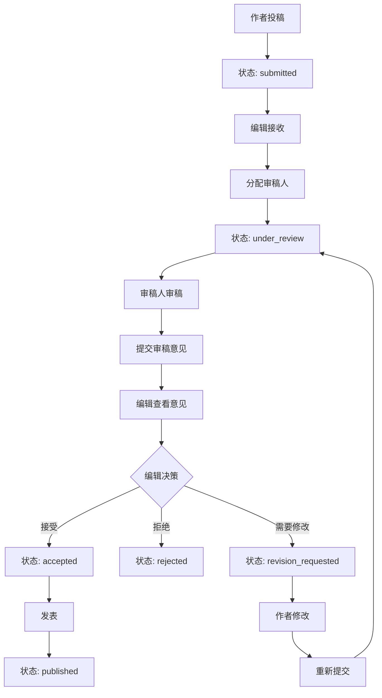

# 审稿流程功能说明

## 概述

我们已经成功实现了完整的投稿审稿流程，包括作者投稿、编辑管理、审稿人审稿和编辑决策等核心功能。

## 功能特性

### 1. 作者投稿系统 (`/submission`)
- ✅ 投稿表单填写
- ✅ 文件上传功能
- ✅ 投稿状态跟踪
- ✅ 投稿历史查看
- ✅ 修改文章功能（当需要修改时）

### 2. 编辑管理面板 (`/editor`)
- ✅ 稿件列表管理
- ✅ 审稿人分配
- ✅ 审稿进度监控
- ✅ 编辑决策功能
- ✅ 统计信息展示

### 3. 审稿人工作台 (`/reviewer`)
- ✅ 审稿任务列表
- ✅ 稿件下载和审阅
- ✅ 审稿意见提交
- ✅ 审稿状态管理
- ✅ 工作量统计

### 4. 权限控制系统
- ✅ 基于角色的访问控制
- ✅ 不同角色显示不同功能
- ✅ 安全的API接口保护

## 审稿工作流程



## 状态说明

### 文章状态 (Article Status)
- `submitted`: 已投稿，等待编辑处理
- `under_review`: 审稿中，已分配给审稿人
- `revision_requested`: 需要修改，等待作者修改
- `accepted`: 已录用，等待发表
- `rejected`: 已拒绝
- `published`: 已发表

### 审稿状态 (Review Status)
- `assigned`: 已分配，等待审稿人接受
- `in_progress`: 审稿中
- `completed`: 审稿完成
- `declined`: 审稿人拒绝审稿

## 用户角色

### 作者 (Author)
- 可以投稿和管理自己的稿件
- 可以查看投稿状态和审稿意见
- 可以修改被要求修改的文章

### 编辑 (Editor)
- 可以管理所有稿件
- 可以分配审稿人
- 可以做出最终决策
- 可以查看审稿进度

### 审稿人 (Reviewer)
- 可以查看分配的审稿任务
- 可以下载和审阅稿件
- 可以提交审稿意见
- 可以管理审稿状态

### 管理员 (Admin)
- 拥有所有权限
- 可以访问编辑和审稿人功能
- 可以管理系统设置

## API接口

### 文章状态管理
- `PATCH /api/articles/[id]/status` - 更新文章状态
- `POST /api/articles/[id]/status` - 分配审稿人

### 审稿管理
- `POST /api/reviews/[id]` - 提交审稿意见
- `PATCH /api/reviews/[id]` - 更新审稿状态
- `GET /api/reviewers` - 获取审稿人列表

## 数据库设计

### 核心表结构
- `users` - 用户信息
- `articles` - 文章信息
- `reviews` - 审稿记录
- `reviewHistory` - 审稿历史
- `categories` - 期刊栏目

### 关系设计
- 用户与文章：一对多关系
- 文章与审稿：一对多关系
- 用户与审稿：一对多关系

## 测试方法

运行测试脚本：
```bash
./test-review-workflow.sh
```

测试内容包括：
1. 作者投稿流程
2. 编辑管理功能
3. 审稿人工作流程
4. 编辑决策功能
5. 状态流转验证
6. 权限控制测试
7. API接口测试

## 使用指南

### 1. 作者投稿
1. 注册/登录作者账户
2. 访问投稿页面
3. 填写文章信息
4. 上传稿件文件
5. 提交投稿

### 2. 编辑管理
1. 登录编辑账户
2. 访问编辑管理面板
3. 查看待审稿稿件
4. 为稿件分配审稿人
5. 监控审稿进度
6. 基于审稿意见做出决策

### 3. 审稿人审稿
1. 登录审稿人账户
2. 访问审稿人工作台
3. 查看分配的审稿任务
4. 下载并审阅稿件
5. 填写审稿意见
6. 提交审稿结果

## 技术栈

- **前端**: Next.js 14, React, TypeScript
- **样式**: Tailwind CSS
- **数据库**: SQLite with Drizzle ORM
- **认证**: NextAuth.js
- **UI组件**: shadcn/ui

## 部署说明

1. 安装依赖：`npm install`
2. 配置环境变量
3. 初始化数据库：`npm run db:push`
4. 启动开发服务器：`npm run dev`
5. 访问：`http://localhost:3000`

## 后续优化建议

1. **邮件通知系统**: 投稿、审稿分配、审稿完成等关键节点发送邮件通知
2. **文件存储优化**: 集成云存储服务，支持大文件上传
3. **审稿模板**: 提供标准化的审稿意见模板
4. **统计分析**: 增加更详细的统计分析和报表功能
5. **移动端适配**: 优化移动端用户体验
6. **国际化支持**: 支持多语言界面

---

**系统已准备就绪，可以开始使用完整的审稿流程！** 🎉
